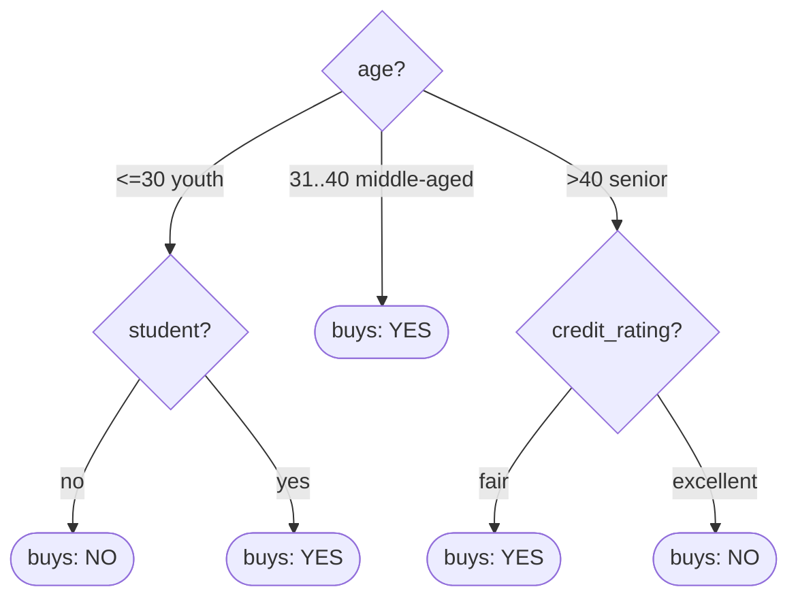

# MLN601 - Module 4 Class Exercise: ID3 Decision Tree

**Dataset:** `buys_computer` (AllElectronics, 14 samples) - Han & Kamber example.
**Goal:** build the decision tree by hand using **Information Gain** (ID3), choosing the best splitting attribute at each node.

---

## The data (14 samples)

| RID | age | income | student | credit_rating | buys_computer |
|----|------|--------|---------|---------------|---------------|
| 1  | <=30   | high   | no  | fair      | **no**  |
| 2  | <=30   | high   | no  | excellent | **no**  |
| 3  | 31..40 | high   | no  | fair      | **yes** |
| 4  | >40    | medium | no  | fair      | **yes** |
| 5  | >40    | low    | yes | fair      | **yes** |
| 6  | >40    | low    | yes | excellent | **no**  |
| 7  | 31..40 | low    | yes | excellent | **yes** |
| 8  | <=30   | medium | no  | fair      | **no**  |
| 9  | <=30   | low    | yes | fair      | **yes** |
| 10 | >40    | medium | yes | fair      | **yes** |
| 11 | <=30   | medium | yes | excellent | **yes** |
| 12 | 31..40 | medium | no  | excellent | **yes** |
| 13 | 31..40 | high   | yes | fair      | **yes** |
| 14 | >40    | medium | no  | excellent | **no**  |

**Class counts:** 9 `yes`, 5 `no` (out of 14).

---

## Formulas

- **Entropy of a node:** `Info(D) = - Σ pᵢ · log₂(pᵢ)`
- **Weighted entropy after splitting on attribute A:** `Info_A(D) = Σ (|Dⱼ| / |D|) · Info(Dⱼ)`
- **Information Gain:** `Gain(A) = Info(D) − Info_A(D)`  ->  pick the **largest** Gain.

---

## Step 1 - Entropy of the whole dataset

`Info(D) = -(9/14)·log₂(9/14) - (5/14)·log₂(5/14)` = **0.940**

---

## Step 2 - Gain for each attribute (root candidates)

### age  (values: <=30, 31..40, >40)
| value | samples | yes / no | Entropy |
|---|---|---|---|
| <=30 (youth) | 5 | 2 / 3 | 0.971 |
| 31..40 (middle-aged) | 4 | 4 / 0 | **0.000** |
| >40 (senior) | 5 | 3 / 2 | 0.971 |

`Info_age(D) = (5/14)(0.971) + (4/14)(0) + (5/14)(0.971)` = **0.694**
**Gain(age) = 0.940 − 0.694 = 0.246**  ✅ (matches the lecturer's 0.694)

### income  (values: high, medium, low)
| value | samples | yes / no | Entropy |
|---|---|---|---|
| high | 4 | 2 / 2 | 1.000 |
| medium | 6 | 4 / 2 | 0.918 |
| low | 4 | 3 / 1 | 0.811 |

`Info_income(D) = (4/14)(1.000) + (6/14)(0.918) + (4/14)(0.811)` = **0.911**
**Gain(income) = 0.940 − 0.911 = 0.029**

### student  (values: yes, no)
| value | samples | yes / no | Entropy |
|---|---|---|---|
| yes | 7 | 6 / 1 | 0.592 |
| no  | 7 | 3 / 4 | 0.985 |

`Info_student(D) = (7/14)(0.592) + (7/14)(0.985)` = **0.788**
**Gain(student) = 0.940 − 0.788 = 0.151**  ✅ (matches the lecturer's 0.151)

### credit_rating  (values: fair, excellent)
| value | samples | yes / no | Entropy |
|---|---|---|---|
| fair | 8 | 6 / 2 | 0.811 |
| excellent | 6 | 3 / 3 | 1.000 |

`Info_credit(D) = (8/14)(0.811) + (6/14)(1.000)` = **0.892**
**Gain(credit_rating) = 0.940 − 0.892 = 0.048**

### Root decision
| Attribute | Gain |
|---|---|
| **age** | **0.246** ← highest |
| student | 0.151 |
| credit_rating | 0.048 |
| income | 0.029 |

➡️ **Root node = `age`.**

---

## Step 3 - Recurse on each branch of `age`

### Branch `age = 31..40` (middle-aged)
All 4 samples are `yes` (entropy 0). ➡️ **Leaf = YES.**

### Branch `age = <=30` (youth) - 5 samples (2 yes, 3 no), entropy 0.971
Split candidates inside this subset:

| split on `student` | samples | yes / no | Entropy |
|---|---|---|---|
| yes | 2 (RID 9, 11) | 2 / 0 | 0.000 |
| no  | 3 (RID 1, 2, 8) | 0 / 3 | 0.000 |

`Info_student = 0` -> **Gain = 0.971** (a perfect split). ➡️ split on **`student`**:
- `student = no`  -> **Leaf = NO**
- `student = yes` -> **Leaf = YES**

### Branch `age = >40` (senior) - 5 samples (3 yes, 2 no), entropy 0.971
| split on `credit_rating` | samples | yes / no | Entropy |
|---|---|---|---|
| fair | 3 (RID 4, 5, 10) | 3 / 0 | 0.000 |
| excellent | 2 (RID 6, 14) | 0 / 2 | 0.000 |

`Info_credit = 0` -> **Gain = 0.971** (a perfect split). ➡️ split on **`credit_rating`**:
- `credit_rating = fair`      -> **Leaf = YES**
- `credit_rating = excellent` -> **Leaf = NO**

---

## Final Decision Tree

```
                 ┌──────────────┐
                 │     age?      │
                 └──────┬───────┘
        <=30           │ 31..40            >40
   ┌───────────┐       │            ┌───────────────┐
   │  student? │   [YES leaf]       │ credit_rating?│
   └─────┬─────┘                    └───────┬───────┘
    no   │   yes                     fair   │   excellent
  [NO]   │  [YES]                   [YES]   │     [NO]
```



### Decision rules (root -> leaf)
1. IF `age = 31..40` -> **YES**
2. IF `age = <=30` AND `student = no` -> **NO**
3. IF `age = <=30` AND `student = yes` -> **YES**
4. IF `age = >40` AND `credit_rating = fair` -> **YES**
5. IF `age = >40` AND `credit_rating = excellent` -> **NO**

The tree classifies **all 14 training samples correctly** (100% on the training set).

---

*Method: ID3 / Information Gain. Entropy values rounded to 3 decimals. Verified against the lecturer's in-class figures (Info(D)=0.940, Info_age=0.694, Gain(student)=0.151).*
