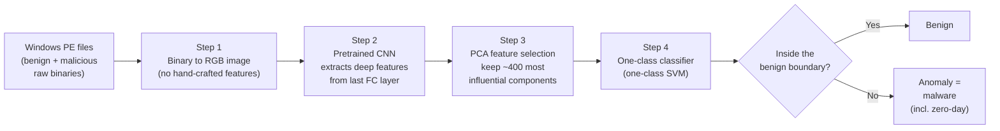
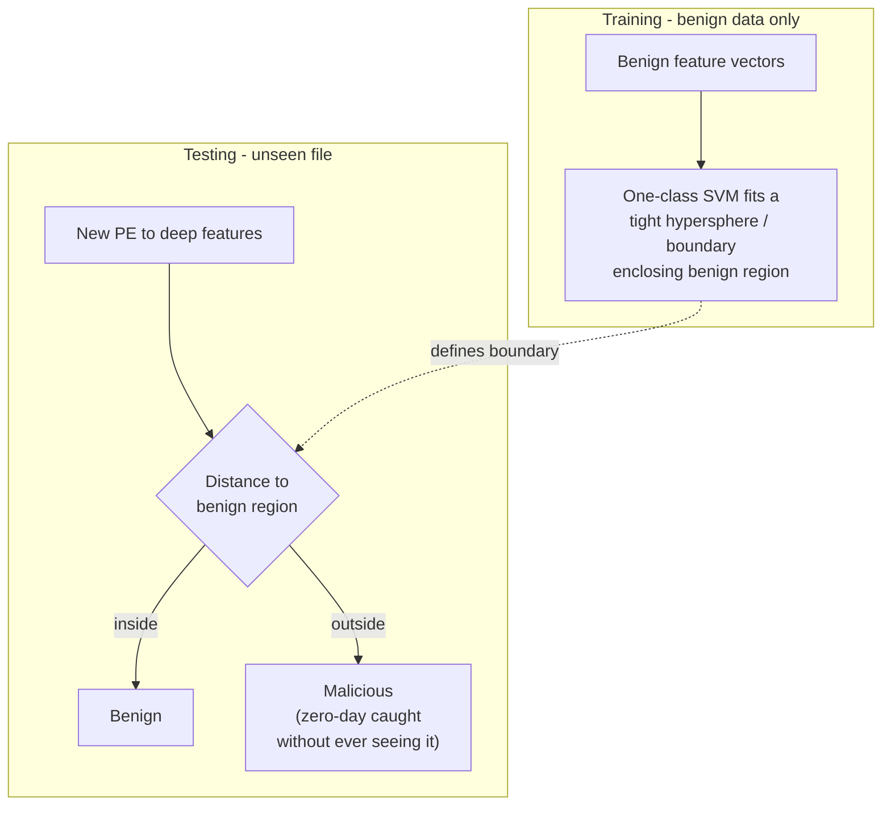
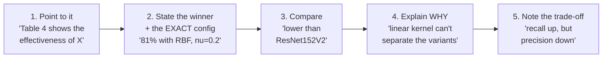

# Module 9 - Class Notes (Week 9 live session)

Extracted from `MLN601 - Machine Learning - Lecturer Week 1 - Week 12` (Teams recording, week 9 segment, ~2h34m).
Facilitator: Dr Kamran Shaukat.

> **Shape of the session:** ~10 min assessment admin (A1 marking held back to be fair to extensions;
> A2 just submitted; A3 previewed) → a **recap of the whole course** (ML → supervised/unsupervised) →
> **similarity/distance metrics** (the part missing from the readings) → **cluster analysis theory** →
> **K-means worked by hand** → **limitations → DBSCAN / OPTICS / K-medoids** → activities.
>
> ⚠️ **The live lecture is substantially broader than the 4 module readings.** The readings are K-means-only;
> the lecturer built the *whole clustering family* around it. Everything in sections 2 and 6 below is
> lecture-only material not covered by resources 1-4.

---

## 1. Course recap (his framing, almost verbatim)

- **Machine learning** = "a branch of AI which performs certain action without explicitly being programmed", learning patterns from data.
- **Algorithm vs model:** an algorithm is step-by-step instructions; run it on data and it *learns patterns* → the output is a **model**. ("Model is the output of an algorithm executed on data.")
- **Measurement vs model** (a student asked): a *measurement* is a quantity used inside the algorithm (entropy, information gain, a distance, Bayes' theorem); the *model/algorithm* is the technique that consumes those measurements. e.g. Naive Bayes = model, Bayes theorem = measurement; K-means = model, the distance = measurement.
- **Supervised** (label known) → **classification** (categorical label: binary / multi-class) or **regression** (continuous label). **Unsupervised** (no idea what you're predicting) → **clustering**: explore, then let the data separate into groups by *similarity*.
- **His clustering intuition:** grouping students by gender / continent / domestic-vs-international; supermarket aisles (dairy together, produce together) - "you need to calculate the similarity of one item to another."

---

## 2. Similarity & distance metrics ⭐ (lecture-only - NOT in the readings)

This is the biggest gap between the readings and the lecture. He spent ~40 min here because "changing the similarity metric can make a huge difference to the performance of your algorithm."

- **Similarity** = numerical measure of how alike two objects are, **higher = more alike**, usually in [0,1]. **Dissimilarity** = the reverse, **min 0 = identical**. **Proximity** = umbrella term for either (so if asked to "calculate proximity" you must ask which).

### Numeric attributes
| Metric | Formula (idea) | Note |
|---|---|---|
| **Euclidean distance** | `√( Σ (aᵢ − bᵢ)² )` | the default. **Why square then root:** squaring kills the sign (so +3 and −3 don't cancel to a fake "similar"), the root re-normalises back to the real scale. Symmetric: `d(P1,P3) = d(P3,P1)`, so you only fill the upper triangle of a distance matrix; diagonal = 0. |
| **Minkowski distance** | `( Σ |aᵢ − bᵢ|^r )^(1/r)` | **the generalised form** - `r` picks the metric below |
| → `r = 1` | **Manhattan** | no square, no root - just absolute differences summed |
| → `r = 2` | **Euclidean** | the squared/rooted one |
| → `r = ∞` | **Supremum / Chebyshev** ("supremom" in the transcript) | take the **maximum** single-attribute difference |

He worked all three by hand on a 4-point example (P1-P4, two attributes). Worth re-deriving one from the `.srt` if it doesn't click.

### Binary attributes (vectors of 0/1)
- **Simple Matching Coefficient (SMC)** = (matches) / (total), counts **0-0 matches as similarity**.
- **Jaccard coefficient** = ignores 0-0 matches (only 1-1 over 1-1 + mismatches).
- ⭐ **His key point:** SMC and Jaccard can disagree hard. If "0 = attribute absent", does *both absent* count as similar? Two international students who **both** lack PR *are* alike on that feature (SMC says similar; Jaccard says nothing). Choose the metric to match what "absence" means in your domain.

### Documents
- **Cosine similarity** - for term-frequency vectors. SMC/Jaccard only see present/absent (1/1), but a word appearing **10× vs 1×** should not read as identical. Cosine uses the **actual counts**: `cos = (D1·D2) / (‖D1‖‖D2‖)`. His example landed at ~0.3 (≈30% similar).

---

## 3. Cluster analysis - the two quantities

- **Goal:** objects in the **same** cluster highly similar; objects in **different** clusters highly dissimilar.
- **Intra-cluster similarity** = distances *within* one cluster. **Inter-cluster similarity** = distances *between* clusters. Mnemonic he gave: **"interstate = between two states"** → inter = between clusters.
- **Aim:** **maximise intra-cluster similarity** (points in a cluster tight/cohesive) and **minimise inter-cluster similarity** (clusters far apart, so points can't leak into the wrong one). *(He mis-spoke the direction once mid-lecture but stated it correctly in the wrap-up - this is the correct version.)*
- **Applications he named:** document grouping, gene/bioinformatics (cancer cells), data reduction, customer segmentation, image segmentation, anomaly detection, recommender systems (YouTube playlists, movie genres), social networks, market-basket, supermarket/store layout, hospital wards.
- **Crowd-sourced examples (your class):** Luis → **student engagement segmentation**; Ferdi → insurance at-risk policyholders; Suleiman → students by learning style / academic performance for personalised support; another → Uber **Pool** ride-sharing (cluster nearby pickup/drop-off) and Uber Eats order batching; client/customer segmentation by turnover replacing a manual team-leader-with-Excel process.

---

## 4. Types of clustering

| Axis | Type A | Type B |
|---|---|---|
| **Structure** | **Partitional** - flat split into k groups | **Hierarchical** - nested tree (suburb → city → state → country) |
| **Membership** | **Exclusive** - a point belongs to exactly one cluster (partitional) | **Non-exclusive** - a point can belong to several (hierarchical) |
| **Coverage** | **Complete** - every point assigned | **Partial** - only cluster a subset of interest |

K-means is **partitional, exclusive, complete**.

---

## 5. K-means, worked by hand ⭐

- **k = how many clusters you want.** You must set it up front.
- **Loop:** place k centroids randomly → for every point compute distance to each centroid → assign to nearest → **recompute each centroid as the mean of its assigned points** → repeat until **no point changes cluster** (the halting/stopping criterion).
- **Objective function = SSE (sum of squared errors)** - the squared distance of points to their centroid. (This is the same quantity the readings call **inertia / WCSS**.)
- **His worked example:** 7 instances, 2 attributes (x,y), k=2, initial centroids = instance 1 (1,1) and instance 4 (5,7). Euclidean distances → assign → recompute centroids as column means of each group → re-assign. A point that was equidistant in round 1 got resolved in round 2 once centroids moved. He showed a 6-iteration figure where iterations 5 and 6 were identical → stop.
- **Ties:** if a point is equidistant to two centroids, assign to either - the next iteration resolves it.

---

## 6. Limitations → DBSCAN / OPTICS / K-medoids ⭐ (lecture-only)

He was explicit: *"this is not part of your ML course, but you should know these exist."* Great context for A3 and for the "why did K-means fail?" comparison questions.

**Where K-means struggles:**
1. **Different cluster sizes / densities** - a sparse-but-real cluster gets torn apart or absorbed.
2. **Non-globular / non-convex shapes** - his **S-shape** example: K-means slices it into two spherical blobs when the true structure is one curved cluster. K-means clusters are always roughly **spherical**.
3. **Outliers** - because centroids are **means** (his vice-chancellor-salary analogy: one 700K salary drags the "average employee" estimate).

**The alternatives:**
| Algorithm | Fixes | How |
|---|---|---|
| **K-medoids / K-median** | outlier sensitivity | use the **median / an actual data point** as the centre instead of the mean |
| **DBSCAN** | non-globular shapes, noise, **and you don't specify k** | density-based: parameters **eps** (radius) + **minPts**. A point with ≥ minPts neighbours in its eps-radius = **core point**; on the edge = **border point**; otherwise = **noise/outlier**. Forms arbitrary shapes. |
| **OPTICS** | DBSCAN's weakness with **varying density** | like DBSCAN but can **adjust the reachability distance** along the way, so clusters of different densities are handled. |

**K-means vs DBSCAN (his summary table):**
- K-means: **must** specify k · always returns clusters (even from scattered data) · **spherical** shape · struggles with noise/outliers.
- DBSCAN: **k not required** · **arbitrary shapes** · handles noise/outliers · **but** on very scattered data may label *everything* as noise → no clusters at all.

---

## 7. Assessment notes (from the admin bookends)

- **A1** marking is being **held back deliberately** until the extension students submit, so results + feedback publish together (expected before the following week's lecture).
- **A2** - he confirmed a couple of just-late / wrong-extension submissions as **on time / no penalty**.
- **A3 is a REGRESSION task**, "similar to Assessment 1" - reuse your A1 model zoo, just swap the dataset; keep GridSearchCV + explainable AI. **Not a clustering assessment.** Detailed spec to come in the next 1-2 lectures.
- Course is near its end; the two module-9 activities (365 Data Science pros/cons video + the K-means implementation notebook) were offered as optional in-class work.

---

## What this changes in the module notes

1. **Distance metrics were entirely absent** from resources 1-4 but are ~40 min of the lecture and the *foundation* of clustering. Add Euclidean/Minkowski (Manhattan/Euclidean/Chebyshev), SMC vs Jaccard (the "0-0 counts?" point), and cosine → promote into notes + one-pager.
2. **SSE = inertia = WCSS** - add SSE as the lecturer's name for the objective (a 4th synonym alongside the readings' three).
3. **DBSCAN / OPTICS / K-medoids** are lecture-only but he leaned on them hard as the answer to "why K-means failed". This is exactly the module09_notes.md "algorithm comparison" material made concrete - cross-link it.
4. **intra vs inter-cluster + the interstate mnemonic** - clean framing worth capturing.
5. **A3 is regression, not clustering** - important expectation-setting; note it so we don't over-invest clustering into A3.

---

# Appendix - The lecturer's own paper (emailed with the slides)

**Shaukat, K., Luo, S., & Varadharajan, V. (2024). A novel machine learning approach for detecting
first-time-appeared malware. _Engineering Applications of Artificial Intelligence, 131_, 107801.**
Elsevier, open access (CC BY), Q1 journal. Dr Kamran is **first + corresponding author**
(kamran.shaukat@uon.edu.au). File: `lecturer_Detecting-First-Time-Appeared-Malware_Shaukat-2024.pdf`.

> ⚠️ **This is barely a K-means paper.** The method is deep learning + one-class SVM. He shared it as
> (a) a real-world example of the *distance/anomaly* thinking behind clustering, and (b) a **writing model**
> - the results-reporting style is exactly what he rewards in assessments. Treat it as a writing template,
> not a method to reproduce.

## A. The problem, plainly

- **Malware** = code that disrupts a system. **First-time-appeared malware** = variants no detector has seen:
  **polymorphic** (mutates its own code each infection) and **zero-day** (brand-new, no signature yet).
- **Why traditional detection fails on these:** signature/static analysis needs a *known* pattern;
  dynamic analysis (run it in a sandbox) is slow and resource-heavy; both need domain experts and
  reverse engineering, and neither generalises to unseen variants.
- **The core bind:** malware datasets are **massively imbalanced** (tons of benign, few malicious; and
  within malicious, some families have 2942 samples vs others 42). Classic fixes - oversampling/SMOTE,
  augmentation - are *dangerous here*: rotating a malware image 2° might turn it into something that
  looks benign. So you cannot safely synthesise malware data.

## B. The four-step pipeline

His whole framework is four steps. This is the figure to internalise:

**The four ideas, one per step:**

1. **Malware as a picture.** Each executable's raw bytes are drawn as an image. Nataraj (2011) did this
   in *greyscale*; Shaukat's contribution is **RGB colour**, which represents variants that greyscale
   blurs together. This **eliminates feature extraction entirely** - no expert, no reverse engineering.
2. **Transfer learning as a feature extractor.** Instead of training a deep net end-to-end (expensive),
   take a CNN **already trained** on images and read the vector from its **last fully-connected layer** -
   those are the "deep features". He compared three of increasing depth: **VGG19 (19 layers, 20.1M params)
   → ResNet152V2 (54.4M) → RegNetY320 (320 deep, 145M)**. Deeper = richer features = ~10% better.
3. **PCA to slim the features.** The feature vector is huge → run **PCA**, keep `n_components ≈ 400`.
   Fewer dimensions = faster detector *and* higher accuracy (curse-of-dimensionality again - the exact
   reason module 9 says "PCA before clustering").
4. **One-class classification** - the clever part (below).

## C. Why one-class classification (the module-9 connection)

A normal classifier learns a boundary *between* two labelled classes. But you **can't** enumerate every
future zero-day - so you can't label the "malware" side. Solution: learn a boundary around the **benign
class only**, and call **anything outside** it an anomaly.

**This is a clustering idea in disguise:** it's about **distance to a region** and **anomaly = far away** -
the same intra/inter-distance logic as K-means, but with a single learned boundary. The `ν` (nu)
hyperparameter controls how tight the boundary is (roughly, the fraction of benign points allowed
outside). The `kernel` (RBF/linear/sigmoid/poly) sets the boundary's shape - like linear vs RBF in an SVM.

## D. How he evaluates (steal this for imbalanced problems)

He **never trusts plain accuracy** on imbalanced data (your A2 lesson exactly). He reports a whole panel:
**balanced accuracy, precision, recall, specificity, F1, G-means, AUC** - and reads them together. Best
config: **RBF kernel + ν = 0.2**, features from **RegNetY320**, then PCA + feature selection →
**89% → 92% accuracy**, and **99.30%** headline on Malimg. Then he proves the gains aren't luck with a
**Wilcoxon signed-rank test (P ≪ 0.0001)** - non-parametric significance testing across models.

## E. The writing patterns to copy (why his style earns marks)

You noticed his writing resembles yours - here is *what specifically* makes it score, distilled into a
reusable formula. **Every table/figure gets a paragraph built like this:**

Five habits worth transplanting into A3:

1. **A paragraph per visual** - never drop a chart/table without saying what to look at, who won, and why.
2. **Interpret correlations, don't just report them** - narrate direction (up/down) *and* the trade-off
   (recall↑ at the cost of precision↓).
3. **Justify with numbers, not adjectives** - "richer features because depth 320 vs 19", not "better model".
4. **An honest `Limitations` section** - he has one (4.3.2: "sensitive to noisy data"). Your lecturer
   explicitly docks students who under-write limitations/deployment.
5. **Prove significance** - even a simple statistical test on your model comparison lifts you above the cohort.

**IMRaD skeleton he uses** (maps cleanly onto your CRISP-DM):
`Introduction → Related work → Methodology (numbered steps + a flow figure) → Results & discussion
(one sub-section per experiment) → Time complexity → Limitations → Conclusion`.

> **Bottom line:** he is the marker. Matching his results-reporting rhythm - point, quantify, compare,
> explain, qualify - is literally writing to the rubric's author.

---

# Appendix B - Dr Kamran's malware-detection trilogy (reference)

The 2024 paper he emailed is the **last of three** he published in the *same* journal (*Engineering
Applications of Artificial Intelligence*), all with the **same author trio: Kamran Shaukat, Suhuai Luo,
Vijay Varadharajan**. Verified via Crossref. Knowing the arc is useful context (and answers a question he
raised in class about malware *adapting* to detectors).

| Year | Title | Where | Theme |
|---|---|---|---|
| **2022** | *A novel method for improving the **robustness** of deep learning-based malware detectors **against adversarial attacks*** | EAAI, vol. 116, art. 105461 | Malware that **adapts to evade** the detector (adversarial ML) |
| **2023** | *A novel deep learning-based approach for malware detection* | EAAI (S0952197623002142) | Core deep-learning detection |
| **2024** | *A novel machine learning approach for detecting first-time-appeared malware* | EAAI, vol. 131, art. 107801 | Zero-day / one-class SVM (the one on file) |

## The "malware adapted to it" thing (chronology corrected)

- In class he mentioned that after publishing, malware **adapted** and he had to respond. The technical name
  is **adversarial attacks / adversarial examples**: an attacker makes a tiny perturbation to a binary that
  does **not** change its malicious behaviour, but pushes its feature vector across the classifier's decision
  boundary - so the malware keeps working while the detector now reads it as benign. (Same fragility as
  "rotate a malware image 2° and it looks benign", but weaponised on purpose.)
- **⚠️ Chronology (confirmed by the author):** in an email reply, Dr Kamran confirmed the pipeline reading
  above is correct **and** that the adversarial-attack work was **not** incorporated into the 2024 paper - it
  was *"one of the research questions during my PhD"*, done earlier with his supervisors. So the adversarial-
  **robustness** work (**2022**) *precedes* the 2024 first-time-appeared paper; "2024 is the latest of the
  trilogy" is correct, but the adaptation response is **not** a follow-up *to* it. His 2022 method proposed
  adversarial-example generators (**NI-FGSM / NMI-FGSM**, negative + momentum variants of the Fast Gradient
  Sign Method) and then hardened the detector by training against them.

## Why this ties back to Module 10 (PAC)

- PAC assumes train and test are drawn from the **same fixed distribution**. **Adversarial ML is the
  attacker deliberately breaking that assumption** at test time. It is learning theory's core premise turning
  into a security problem - a sharp example to cite when discussing the *limits* of PAC / learning theory.

*Refs:* [2022 robustness paper](https://www.sciencedirect.com/science/article/abs/pii/S0952197622004511) ·
[2023 detection paper](https://www.sciencedirect.com/science/article/abs/pii/S0952197623002142) ·
2024 first-time-appeared paper = `lecturer_Detecting-First-Time-Appeared-Malware_Shaukat-2024.pdf` (on file).
