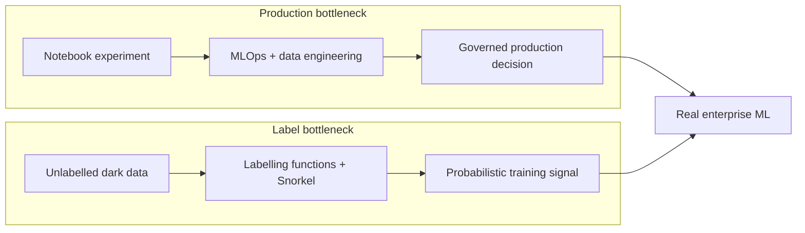

# MLN601 · Module 12 - One-Pager

> **Enterprise-grade ML · notebook-to-production · MLOps & data engineering · score in the DBMS · weak supervision · Snorkel & probabilistic labels**
> A fast, hand-write-it-yourself sheet. Built for 3 pens on a blank A4 (landscape).

**Pen legend:** 🖤 Black = skeleton / always-true · 🔵 Blue = definitions & examples · 🔴 Red = exam + assessment hooks

---

## 🖤 The Big Idea (box it, centre of page)
> **Real-world ML is blocked by two last-mile problems: getting a trained model into a governed production system, and getting enough trustworthy labels to train it. Enterprise ML engineers productionise the model; weak supervision engineers the labels.**
> (Macey & Dewalt, 2019 · Algorithmia, 2020 · Agrawal et al., 2020 · Bell, 2019 · Macey & Ratner, 2018)



## 🖤 Zone 1 - Production is the real workload ⭐ SLO a) + d)

- 🖤 **Model development is <20%** of the project lifecycle. Most work is data collection, cleaning, plumbing, integration, deployment, monitoring, and governance (Agrawal et al., 2020; Macey & Dewalt, 2019).
- 🔵 **Algorithmia's reality check:** **55%** had never deployed a model; most deployments took **31-90 days**; **18%** took over 90 days; **43%** named scale the top challenge; **41%** named versioning/reproducibility (Algorithmia, 2020).
- 🖤 **A model in a notebook is an experiment, not a product.** Production needs a packaged artifact, repeatable pipeline, health metrics, drift/failure monitoring, rollback, access control, and ownership.
- 🔵 **Data engineer = the unlock:** builds SQL, storage, ingestion, transformation, and deployment plumbing between the data scientist and production IT (Macey & Dewalt, 2019).
- 🔴 **Success has two languages:** practitioners watch accuracy, latency, drift, and reproducibility; executives watch ROI, cost, adoption, and risk. Directors / AI product managers must bridge both.
- 🔴 **Last-mile trap:** an accurate insight delivered too late has no business value. Deployment speed and operating reliability are model-quality concerns.

## 🖤 Zone 2 - EGML: train, score, govern ⭐ THE DATABASE CORE

> **"An ML model is software derived from data."** (Agrawal et al., 2020)

| Dual nature | Therefore it needs |
|---|---|
| **model as software** | CI/CD, tests, packaging, APIs, monitoring, rollback |
| **model as data** | lineage, provenance, versioning, access control, audit |

```text
TRAIN IN CLOUD  ->  SCORE IN DBMS  ->  GOVERN EVERYWHERE
central data        model near data     data -> model -> decision lineage
elastic compute     less movement       privacy, fairness, auditability
```

- 🖤 **EGML = Enterprise-Grade ML:** millions of moderately valuable applications built by small domain teams, but held to strict security, privacy, fairness, bias, and audit requirements.
- 🔵 **Score in the DBMS:** execute inference beside stored data instead of exporting sensitive rows to another service. Early experiments reported **5x-24x speedups** (Agrawal et al., 2020).
- 🔵 **ONNX:** an open interchange format for moving trained models between frameworks and deployment runtimes. Activity 1 connects ONNX with Azure SQL Edge and IoT sensor scoring.
- 🔴 **Federated-learning distinction:** edge scoring keeps inference near data; federated learning trains across distributed nodes by sharing model updates rather than raw data. One does not automatically imply the other.

## 🖤 Zone 3 - Enterprise adoption is a team and product problem

| Casey's hard truth | Enterprise response |
|---|---|
| wrong team | interdisciplinary modelling, data, API, UI/UX, and product roles |
| no business-tech bridge | AI product manager translates value and constraints |
| many "truths" | define label policy and ground truth collaboratively |
| training treated as finish line | iterate, monitor, and track the right metric |
| traditional software mistakes | automate repeatable, containerised MLOps pipelines |

- 🖤 **No unicorn:** enterprise ML needs internal domain knowledge plus external or specialist capability. Roles include data engineering, MLOps, DataOps, MLUX, governance, and AI product management (Casey, 2020).
- 🔵 **Value-capture archetypes:** (1) traditional firms applying ML, (2) horizontal ML-tool vendors, (3) vertically integrated ML applications (Xu, 2020, partial source).
- 🔴 **Adoption requires legitimacy:** involve affected users early, explain purpose and limits, make ownership visible, provide training and feedback channels, and connect technical metrics to business outcomes.
- 🔴 **"AI for AI's sake" warning:** a vendor or model is not valuable because it uses ML. Start from an organisational problem, measurable benefit, and operating responsibility.

## 🖤 Zone 4 - Weak supervision: engineer the labels ⭐

- 🖤 **Why:** gold labels are scarce, slow, costly, inconsistent, or ethically difficult. Enterprise **dark data** is unstructured and untapped, so supervised models cannot consume it directly (Bell, 2019; Macey & Ratner, 2018).
- 🔵 **Evolution:** expert systems engineered decisions -> classical ML engineered features -> DL engineered architectures -> weak supervision engineers **labels**.

```text
DOMAIN EXPERTS WRITE LABELLING FUNCTIONS (LFs)
       LF1    LF2    LF3 ... LFn
       +1     -1      0       +1     (+1 / -1 / 0 = vote / oppose / abstain)
         \     |      |      /
          GENERATIVE LABEL MODEL
       learns LF accuracy + correlation
                    |
          probabilistic labels P(y|x)
                    |
          DISCRIMINATIVE MODEL
       trains with log-loss / cross-entropy
```

- 🔵 **LF sources:** expert rules, humans, graph/similarity signals, weaker models, dictionaries, or data augmentation. Example: `>5 credit cards in one day -> suspicious`.
- 🖤 **Two-model distinction:** the generative model combines and de-noises LF votes; the discriminative model learns features from the resulting probabilistic labels.
- 🔴 **Why not a random forest downstream?** The learner must consume probabilistic labels; log-loss / binary cross-entropy supports them naturally.
- 🔵 **Reported fraud result:** about **20 LFs produced +2% recall** on an already mature model, a meaningful gain (Bell, 2019).

## 🖤 Zone 5 - Snorkel workflow, diagnostics, and honest limits

```text
~100 GOLD LABELS -> WRITE LFs -> CHECK -> ITERATE TO ~90%
                                      |
                       coverage · conflict · polarity
                                      |
                    LABEL DATA -> TRAIN -> HELD-OUT TEST
```

- 🔵 **Coverage:** how often an LF votes. **Conflict:** how often LFs disagree. **Polarity:** which classes each LF can emit.
- 🔴 **Always retain a gold hold-out set.** If generated labels are also used as truth, evaluation becomes circular.
- 🖤 **Goldilocks density:** too few LF votes per item collapses toward plain supervision / majority vote; too many makes majority vote strong already. The generative label model helps most in the middle (Bell, 2019).
- 🔴 **Do not tune LF thresholds directly against all gold labels.** That turns the rules into a poorly constructed classifier and leaks evaluation truth.
- 🔵 **Powell's field result:** majority vote sometimes beat probabilistic Snorkel; a single expert may do better hand-labelling. Snorkel's strongest case is many noisy, conflicting labellers at scale (Powell, 2020).
- 🔴 **Use direct supervision when abundant, reliable gold labels are cheap.** Weak supervision solves label scarcity; it is not automatically superior.

## 🔴 Assessment Hook (bottom red strip)
> **Assessment 3 - Machine Learning Project** · notebook + model selection · up to **2000 words** · **40%** · due **19/08/2026** · assessment SLOs **a) b) c) d)**; Module 12 directly addresses **a) d)**.
> Module 12 completes the CRISP-DM story: do not stop at model selection and test metrics. State how the chosen model would be packaged, deployed, monitored, versioned, governed, explained to stakeholders, and retrained when data or labels drift. If labels are expensive, distinguish genuine ground truth from weak signals and explain how you would evaluate any programmatic-labelling approach.

## 🔴 If you only memorise 5 things

1. **Two bottlenecks:** productionise the model; engineer the labels.
2. **Model building is <20%; 55% never deployed.** The last mile is data, MLOps, scale, monitoring, and governance.
3. **EGML = train in cloud -> score in DBMS -> govern everywhere.** A model is both software and derived data.
4. **Snorkel = LFs (+1/-1/0) -> generative label model -> probabilistic labels -> discriminative model.**
5. **Keep gold truth separate.** Watch coverage/conflict/polarity; weak supervision helps most when many noisy labels exist and clean labels do not.

---

### Margin prompts (answer in blue while you write - anchor to your day job)

1. For a St Catherine's attendance-risk model, sketch `source systems -> warehouse -> model -> intervention`. Where would you score it, who owns each step, and what lineage must exist before a student-facing decision is defensible?
2. If counsellor notes are dark data, write three LFs that could label "needs follow-up" while allowing abstention. What 100 examples would form the gold set, and which coverage/conflict result would make you distrust the rules?

### This-week to-dos (still 🕐 / 🔥 in your notes)

- [ ] 🕐 **Activity 1 - Azure SQL Edge + ONNX:** explain ONNX's usefulness, design your own edge/database deployment scenario, name a non-SQL-Edge alternative, and distinguish edge inference from federated learning.
- [ ] 🕐 **Activity 2 - Snorkel spam tutorial:** write and inspect LFs, then discuss the workflow, one suitable dataset, and alternative labelling approaches.
- [ ] 🕐 **Activity 3 - Human Factor:** choose your role in enterprise adoption and explain how you would reduce resistance, build trust, and connect ML to productive work.
- [ ] 🔥 **Resource 3 - Xu (2020):** obtain the full article through the university library if its value-capture argument is needed beyond the accessible introduction.
