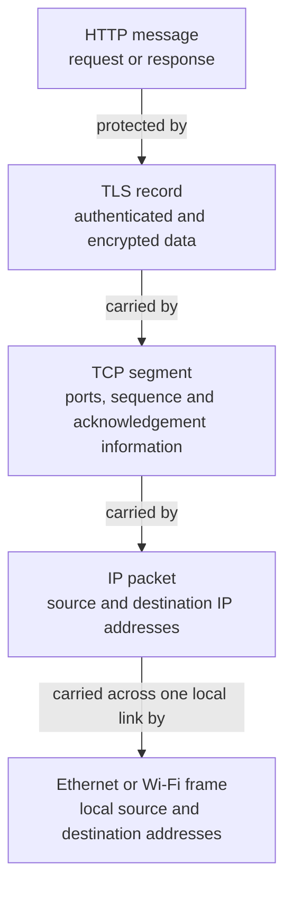
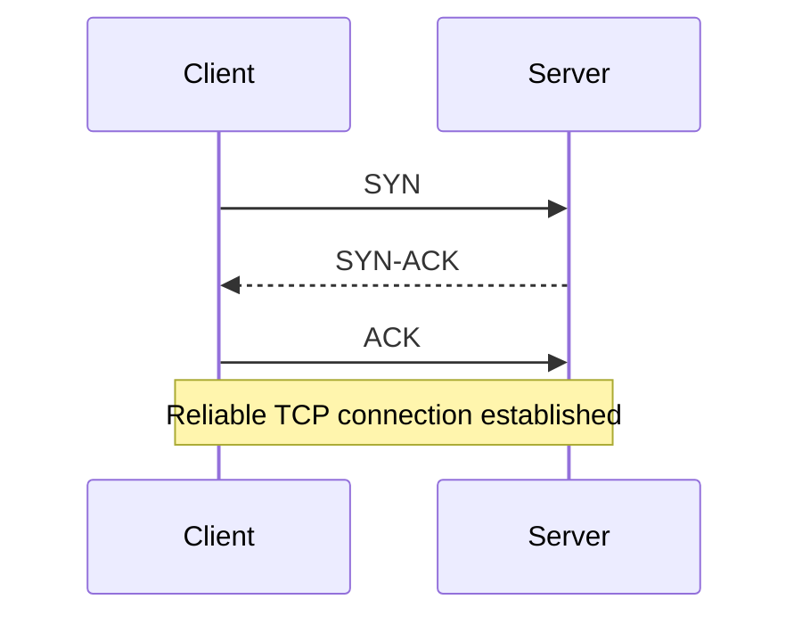
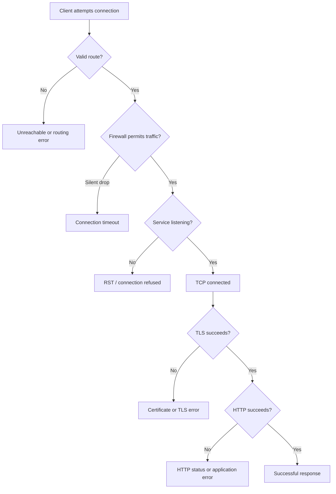

# Networking Foundations: Protocols and CLI Tools

> Living study note for rebuilding networking fundamentals through explanation, retrieval practice, and CLI observation.

## Study status

- **Started:** 29 August 2026
- **Last studied:** 31 August 2026
- **Source reviewed:** [`r1.md`](./r1.md), through approximately `00:10:10`
- **Current position:** The request-response model is assembled. The next lab is inspecting listening TCP sockets with `lsof`.
- **Last demonstrated understanding:** Reconstructed the browser-to-server flow and correctly separated DNS, IP addressing, ports, TCP reliability, TLS security, HTTP, firewalls, local listeners, and remote deployment. A few terms were tightened in the quick recap below.

## Table of contents and progress

| Status | Topic |
|---|---|
| Covered | [The core mental model](#the-core-mental-model) |
| Covered | [Thirty-second recap](#thirty-second-recap) |
| Covered | [DNS and domain resolution](#dns-and-domain-resolution) |
| Covered | [Routing, gateways, and ARP](#routing-gateways-and-arp) |
| Covered | [Frames, packets, segments, and application data](#frames-packets-segments-and-application-data) |
| Covered | [Ports, sockets, and connection identity](#ports-sockets-and-connection-identity) |
| Covered | [TCP and UDP](#tcp-and-udp) |
| Covered | [TLS, HTTPS, and server identity](#tls-https-and-server-identity) |
| Covered | [Firewalls, routes, and listening services](#firewalls-routes-and-listening-services) |
| Covered | [The complete request-response route](#the-complete-request-response-route) |
| Covered | [CLI evidence from the study session](#cli-evidence-from-the-study-session) |
| Covered | [Corrections that changed the mental model](#corrections-that-changed-the-mental-model) |
| Pending | [CLI socket inspection with `lsof` and `netstat`](#pending-learning-path) |
| Pending | `ping`, ICMP, and reachability |
| Pending | `traceroute` and hop-by-hop routing |
| Pending | Deeper DNS: record types, caching, and recursive resolution |
| Pending | TCP lifecycle, termination, flow control, and congestion control |
| Pending | UDP and TCP comparison through CLI experiments |
| Pending | Packet observation with `tcpdump` or Wireshark |
| Pending | SSH and RDP |
| Pending | Applying the model to secure PDF upload and malware scanning |

## The core mental model

When a client requests `https://example.com`, several separate systems cooperate:

```text
DNS       discovers the destination IP address.
Routing   selects the next hop toward that IP address.
ARP       discovers the next hop's MAC address on the local link.
TCP       provides a reliable and ordered byte-stream connection.
TLS       normally authenticates the server and secures the connection.
HTTP      expresses the application request and response.
```

The normal conceptual order is:

```text
DNS → route lookup → ARP → TCP → TLS → HTTP
```

DNS traffic itself also requires routing and local-link delivery. The sequence above focuses on what happens after the client decides it needs to reach a hostname.

## Thirty-second recap

- A **domain name** is a hierarchical, human-readable name. A **hostname** identifies a particular named host or service within that namespace.
- DNS returns structured **resource records** such as `A`, `AAAA`, `CNAME`, `MX`, and `TXT`; it does not establish the application connection.
- An **IP address** is a network-layer address assigned to an interface. Routing uses destination IP addresses to move packets between networks.
- A **port** is a transport-layer number. Together with the protocol and IP addresses, it helps the OS deliver traffic to the correct socket.
- A **protocol** defines the format, meaning, order, and expected handling of communication—not merely how devices connect.
- **TCP** establishes a stateful, reliable, ordered byte stream. Its three-way handshake establishes connection state; it does not authenticate or encrypt.
- **UDP** sends independent datagrams without TCP's built-in connection, ordering, acknowledgement, or retransmission behaviour. Low latency is useful for real-time voice, gaming, DNS, and protocols such as QUIC. Video streaming can use TCP or QUIC as well as UDP-based real-time protocols, so “streaming equals UDP” is too broad.
- **TLS** normally authenticates the server and provides encryption and integrity. For HTTPS over HTTP/1.1 or HTTP/2, TLS starts after TCP connects and before HTTP messages are exchanged.
- **HTTPS** is HTTP protected by TLS. Conventionally, the TCP connection targets port 443; HTTP does not itself “enter through” the port.
- A **firewall** permits, rejects, or drops traffic according to rules involving protocol, addresses, ports, direction, and often connection state. The application must separately have a listening socket.
- **`localhost`** resolves to the loopback interface, normally `127.0.0.1` and/or `::1`. A service bound only to loopback is reachable only from the same machine. A service bound to other interfaces may be remotely reachable if routing and firewall policy permit it.
- A **Vercel URL** resolves through DNS to Vercel's edge infrastructure. TLS is commonly terminated at the edge, which then routes the request to the relevant deployment or function; it should not be pictured as necessarily reaching one permanent cloud server.

Compact HTTPS flow:

```text
Browser/curl → DNS → route lookup → ARP → TCP to destination port 443
             → TLS handshake → encrypted HTTP request → server/edge
             → encrypted HTTP response → TLS decrypts → application reads HTTP
```

## DNS and domain resolution

DNS translates a hostname into records that applications can use. The client supplies the memorable hostname; DNS returns records associated with it.

Common records include:

| Record | Purpose |
|---|---|
| `A` | Hostname to IPv4 address |
| `AAAA` | Hostname to IPv6 address |
| `CNAME` | Alias to another hostname |
| `MX` | Mail server for a domain |

The session's query returned:

```text
example.com → 104.20.23.154
example.com → 172.66.147.243
```

Important observations:

- The query asked for an `A` record.
- `NOERROR` meant the DNS query succeeded.
- The resolver was Google DNS at `8.8.8.8:53`.
- The query took 27 ms.
- The answer TTL was 300 seconds.
- `curl` tried the first returned IPv4 address and did not need the second.

The 300-second TTL belongs to the **DNS cache**. It is unrelated to ARP cache lifetime.

DNS commonly uses UDP port 53 for small queries and responses, but it can use TCP when needed. DNS resolution only returns information; it does not establish the connection to the web server.

## Routing, gateways, and ARP

Routing and ARP answer different questions:

```text
Routing: Where should this IP packet go next?
ARP:     Which local MAC address represents that next-hop IPv4 address?
```

The route lookup showed:

```text
Remote destination: 104.20.23.154
Selected route:      default
Next-hop gateway:    192.168.0.1
Local interface:     en0
MTU:                 1500
```

Because `104.20.23.154` was not on the local network, the Mac sent the local frame to the default gateway. ARP contained an entry mapping `192.168.0.1` to the router's local MAC address.

ARP did **not** contain the MAC address of the remote Cloudflare server. ARP resolves IPv4 neighbors on the local link. The client needs the MAC address of the next hop, not every remote system on the route.

The key distinction is:

```text
Final destination IP: 104.20.23.154
First next-hop IP:     192.168.0.1
First frame's MAC:     the local router interface's MAC address
```

At each routed hop, the router removes the incoming link-layer frame, examines the IP destination, chooses the next hop, and constructs a suitable new local-link frame. The link-layer addresses change hop by hop.

## Frames, packets, segments, and application data

An IP packet is a delivery container, not a request fingerprint.

The data is nested as it moves down the networking stack:



Terminology:

- **Frame:** local-link delivery unit using link-layer addresses such as MAC addresses.
- **Packet:** network-layer delivery unit using IP addresses.
- **Segment:** TCP transport unit using ports, sequence numbers, acknowledgements, and flags.
- **TLS record:** authenticated and encrypted application bytes.
- **HTTP message:** application-level request or response.

One HTTP request can span several TCP segments and IP packets. Multiple packets do not imply multiple HTTP requests.

Some IP packets carry no HTTP content. For example, TCP handshake packets carry TCP flags, and TLS handshake packets carry security negotiation data.

## Ports, sockets, and connection identity

Ports distinguish transport-layer endpoints associated with applications. A server can expose several services through the same IP address because the services listen on different protocol and port combinations.

Examples:

```text
HTTP:   TCP 80
HTTPS:  TCP 443 for HTTP/1.1 and HTTP/2
DNS:    commonly UDP 53, with TCP 53 also available
MySQL:  commonly TCP 3306
```

Ports range from 0 through 65,535. Port 0 is reserved and is not used as an ordinary listening destination.

An HTTPS connection has endpoints on both sides:

```text
Client:53124 → Server:443
Server:443   → Client:53124
```

The server listens on the well-known port. The client's operating system normally assigns an ephemeral source port.

A TCP connection is commonly identified by a five-tuple:

```text
protocol + source IP + source port + destination IP + destination port
```

Different client source ports allow several simultaneous connections to the same server endpoint:

```text
TCP | client IP | 53124 | server IP | 443
TCP | client IP | 53125 | server IP | 443
```

The kernel demultiplexes returning traffic to the correct socket. The owning application then associates data with its own request. A browser tab is not necessarily equivalent to a socket: HTTP/2 can multiplex several request streams through one TCP connection.

## TCP and UDP

Both TCP and UDP use ports, but they offer different delivery models.

| TCP | UDP |
|---|---|
| Performs a connection handshake | Sends without a transport connection handshake |
| Provides reliable delivery | Provides best-effort datagram delivery |
| Presents an ordered byte stream | Preserves datagrams but provides no built-in ordering guarantee |
| Retransmits missing data | Does not retransmit automatically |
| Detects and discards duplicates | Does not provide the same built-in delivery guarantees |
| Includes flow and congestion control | Has minimal transport overhead and leaves more policy to the application |

The TCP three-way handshake is:



TCP then uses sequence numbers, acknowledgements, retransmission, and buffering to present ordered bytes to the application. If segments arrive in the order `1, 3, 2`, TCP can buffer later data and restore the correct order before delivering it to the application.

Typical uses:

```text
HTTP/1.1 and HTTP/2 → TCP
SSH                  → TCP
Database sessions    → TCP
DNS query            → usually UDP
Voice, games         → often UDP
```

UDP is not inherently unreliable at the application level. An application protocol can implement its own delivery guarantees above UDP. QUIC, used by HTTP/3, is an important example.

For a medical PDF upload, complete and ordered delivery matters more than delivering corrupted or incomplete bytes quickly. TCP provides the ordered byte stream; the application must still reject or clean up an upload if the connection ends before completion.

## TLS, HTTPS, and server identity

TCP and TLS solve different problems:

```text
TCP handshake → establish a reliable, ordered connection
TLS handshake → authenticate and establish protected communication
```

Immediately after TCP connects:

```text
Available:     reliable and ordered transport
Not available: cryptographic server identity
Not available: encryption
```

TCP proves that something responded at an IP address and port. It does not prove that the responder is the intended hostname.

TLS normally adds:

- server identity verification through certificates;
- encryption;
- integrity protection against undetected modification;
- negotiation of supported security parameters.

HTTPS means:

```text
HTTPS = HTTP over TLS
```

In the observed `curl` session:

- TCP connected to `104.20.23.154:443`.
- TLS 1.3 was negotiated.
- The certificate covered `example.com` and verification succeeded.
- ALPN selected HTTP/2 (`h2`).
- `curl` sent `GET /`.
- The server returned `HTTP/2 200`.
- Cloudflare served a cached 559-byte HTML response.

`curl -v` displayed readable HTTP because `curl` sees data before encryption and after decryption. A passive network observer normally sees protected TLS records rather than the plaintext HTTP message.

## Firewalls, routes, and listening services

Three independent conditions must be separated:

```text
Routing table → Is there a path to the destination?
Firewall      → Is the traffic permitted?
Application   → Is a service listening on the destination socket?
```

The application listens on a port. The firewall permits or blocks traffic to that port. A firewall rule does not create a listening service.

Many firewalls are stateful. If a client initiates:

```text
Client:53124 → Server:443
```

the firewall can record that connection and permit the matching response:

```text
Server:443 → Client:53124
```

This does not allow arbitrary internet hosts to initiate unrelated connections to the client's ephemeral port.

If the route exists and the firewall permits TCP 443, but no process is listening, the usual sequence is:

```text
Client sends SYN
Firewall permits SYN
Server OS finds no listening socket
Server OS returns RST
Client reports connection refused
```

Troubleshooting ladder:



Routing chooses where traffic goes. A firewall determines whether it may proceed. Network Address Translation changes address or port information and maintains translation state; NAT is not a replacement for firewall policy.

## The complete request-response route

The observed flow can be represented as:

```mermaid
sequenceDiagram
    participant C as curl on Mac
    participant D as DNS resolver 8.8.8.8
    participant O as macOS network stack
    participant R as Home router
    participant I as Internet routers
    participant S as Cloudflare / example.com

    C->>D: Query A record for example.com
    D-->>C: 104.20.23.154 and 172.66.147.243
    C->>O: Connect to 104.20.23.154:443
    O->>O: Route lookup selects 192.168.0.1 via en0
    O->>O: ARP resolves gateway MAC
    O->>R: TCP SYN in IP packet inside local frame
    R->>I: Forward packet, normally with NAT
    I->>S: Deliver toward destination IP
    S-->>C: SYN-ACK through reverse route
    C->>S: ACK; TCP established
    C->>S: TLS handshake
    S-->>C: Certificate and TLS negotiation
    C->>S: Encrypted HTTP/2 GET /
    S-->>C: Encrypted HTTP/2 200 response
    C->>C: TCP orders bytes; TLS verifies and decrypts; curl reads HTTP
```

Outbound local-layer view:

```text
Frame destination MAC → local router
IP packet destination → 104.20.23.154
TCP destination port  → 443
```

Return transport view:

```text
TCP source port      → 443
TCP destination port → client's ephemeral port
```

The home router normally reverses its NAT translation and sends a local frame to the Mac. The kernel matches the returning flow to the established socket. TCP restores ordered bytes, TLS validates and decrypts them, and `curl` interprets the HTTP response.

## CLI evidence from the study session

### DNS

```bash
dig example.com
```

Observed: successful `A` query, two answers, resolver `8.8.8.8:53`, 27 ms query time, and a 300-second DNS TTL.

### TCP, TLS, and HTTP

```bash
curl -v -o /dev/null https://example.com
```

Observed:

```text
Host resolved
Trying 104.20.23.154:443
TCP connected
TLS 1.3 handshake completed
Certificate matched and verified
ALPN selected HTTP/2
GET / sent
HTTP/2 200 received
559 response bytes discarded through /dev/null
```

### Route lookup

```bash
route -n get 104.20.23.154
```

Observed: default route through gateway `192.168.0.1` on `en0`.

### Local neighbor resolution

```bash
arp -an
```

Observed: the gateway had a local MAC mapping; the remote server did not appear in the ARP table.

## Corrections that changed the mental model

| Initial idea | Correct model |
|---|---|
| DNS returns the easy-to-remember address | The client provides the hostname; DNS returns records such as IP addresses. |
| The DNS TTL keeps a remote MAC in ARP | DNS and ARP have separate caches and lifetimes. |
| ARP should contain the remote web server's MAC | ARP resolves local neighbors; the Mac needs its next-hop router's MAC. |
| An IP packet is a request fingerprint | An IP packet is a delivery container with an IP header and payload. |
| TCP performs authentication and encryption | TCP provides reliable ordered transport; TLS normally provides authentication, encryption, and integrity. |
| A valid route and allowed firewall port mean HTTPS works | A process must also be listening, and TLS and HTTP must subsequently succeed. |
| The ephemeral port maps directly to a browser tab | The kernel maps the flow to a socket; the application can multiplex multiple requests over it. |
| NAT is a firewall | NAT translates addresses/ports; firewall rules express permission. |
| DNS returns “text registers” | DNS returns structured resource records; `TXT` is only one specific record type. |
| HTTP enters through port 443 and TLS adds security afterward | TCP targets port 443, then TLS establishes protection, then HTTP is exchanged inside TLS. |
| `localhost:3000` means any local app is automatically reachable | A process must listen on port 3000, and the bind address determines which interfaces can reach it. |
| A Vercel domain maps to one cloud server | DNS normally leads to Vercel edge infrastructure, which routes the request to the deployment. |

## Pending learning path

Recommended order:

1. **Inspect sockets:** distinguish `LISTEN` from `ESTABLISHED` using `lsof` and `netstat`.
2. **Test reachability:** understand ICMP and the limits of `ping`.
3. **Trace routes:** use `traceroute` and understand TTL expiry at successive hops.
4. **Deepen DNS:** query `A`, `AAAA`, `CNAME`, `MX`, and `NS`; inspect caching and resolver roles.
5. **Observe TCP and UDP:** compare connection-oriented streams with datagrams through safe CLI labs.
6. **Inspect packets:** observe DNS, TCP handshake, TLS, and HTTP with `tcpdump` or Wireshark.
7. **Study remote-access protocols:** SSH and RDP, including their port and security models.
8. **Apply the foundation:** map a medical PDF upload through browser, HTTPS, firewall, private storage, quarantine, malware scanner, and authorised retrieval.

## Resume checkpoint

The next command is:

```bash
lsof -nP -iTCP -sTCP:LISTEN
```

Before continuing, retrieve these ideas without reading the sections above:

1. What does DNS return, and what does it not do?
2. Why does ARP show the gateway's MAC rather than the remote server's MAC?
3. What does TCP provide before TLS begins?
4. What does TLS add?
5. If a route exists and the firewall allows port 443 but no process listens, what response is normally expected?
6. Why does a returning HTTPS response target the client's ephemeral port?
