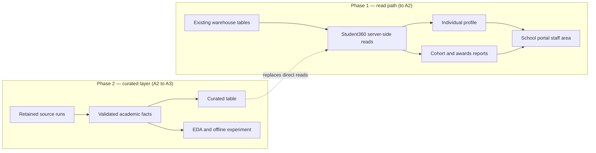

# ITW601 rounds plan — A1 → A2 → A3

> **De-identified public copy.** People appear by role and the school's systems by generic names (SIS = student information system, LMS = learning management system). Planned deliverables are intentions, not claims: a deliverable counts toward a journal only once it actually exists, with its evidence.

**Prepared:** 1 October 2026 · **Placement:** 14 September – 4 December 2026 (12 weeks) · **Project identity:** Student360 on DataWrestler

## TL;DR

One project and three reflective journals. The direction set on 1 October 2026 is to **put Student360 inside the school portal's staff area first**, reading the **existing data-warehouse tables**, so the academic stakeholder gets two things:

- an individual student profile
- cohort-level reports by year (Year 12, Year 11, Years 7–10, including the awards views agreed on 30 September)

A **curated academic layer** (DataWrestler) follows later. It consolidates and versions the data once the read path has proven what staff actually use.

The LMS already shows student information. The aim is a better view: one place, cohort context, rules applied consistently, and freshness shown openly.

| Round | Due | Words | Hours by then | What the journal must show |
|---|---|---|---|---|
| A1 | Sun 11 Oct (end Module 4) | 500 ±10% | 64 / 192 | Understand the organisation and the problem |
| A2 | Sun 15 Nov (end Module 9) | 1,000 ±10% | 144 / 192 | Interview preparation, ICT challenges, and a project synopsis a sponsor can evaluate |
| A3 | Wed 2 Dec (week 12) | 3,000 ±10% | 192 / 192 | Outcome, positioning, a review of the A2 synopsis, and critical reflection |

## Delivery path

The path follows the replacement ladder in the [implementation plan](plan.md#replacement-ladder): **observe → read → act → own → retire**. This term covers *observe* and *read* only.

### Phase 1 — read path on existing tables (now → A2)

| # | Deliverable | Acceptance evidence | Feeds |
|---|---|---|---|
| 1 | Awards rules applied to the existing results: Year 12 rebuild, Year 11, Years 7–10 (mandatory subjects only) | Rules note confirmed by the academic stakeholder; queries reviewed; sanitized counts per year; checked against what teachers see in the LMS | A1 (relationship loop), A2 |
| 2 | Source map for the read path: which warehouse table serves which view and period, with known gaps | Includes the finding that one live report view has lost some Semester 1 rows, so a hand-built snapshot serves that semester | A2 ICT challenges |
| 3 | Staff access design: role for academic leadership, cohort rules, denied cases | Handoff brief to the school-portal lead; tests for permitted and denied roles | A2 synopsis (managerial and technical plan) |
| 4 | Student360 individual profile in the staff area, reading existing tables | Profile reachable only by permitted staff; results match the source; freshness and source label shown | A2, A3 |
| 5 | Cohort reports in the staff area: year level, subject, awards | The academic stakeholder can open their year's report; totals match the agreed rules; incomplete rows flagged | A2, A3 |
| 6 | Weekly checkpoint with the academic stakeholder | Dated notes of what was shown, decided and corrected | Every round |

### Phase 2 — curated layer (A2 → A3)

| # | Deliverable | Acceptance evidence | Feeds |
|---|---|---|---|
| 7 | DataWrestler DW-00/01: source inventory, reuse map, synthetic two-source run with manifest | One command processes synthetic inputs; both sources accounted for | A3 synopsis review |
| 8 | Curated academic table (in the warehouse or dedicated to the portal) that consolidates accepted results with run lineage | Repeat load adds no duplicates; a failed load keeps the previous accepted data; reads switch over with parity | A3 |
| 9 | Award rule snapshots (versioned rules, reproducible yearly results) | Reference cases including ties, missing inputs and the Extension 2 swap | A3 |
| 10 | EDA coverage report and one offline baseline, or a documented finding that the data cannot support the target | Exact denominators and exclusions; leakage-controlled split | A3 reflection |

### Running every week

- **Evidence log:** duties and hours exactly as worked. Planned pace is 16 hours a week to reach 64 → 144 → 192. Confirm with the academic facilitator how placement hours are counted.
- **Control journal:** one dated entry per working session, recording decisions with their source role.

## A2 — Industry Placement Interview and Project Synopsis (1,000 words)

| Section | Words | Draw on | Rubric pressure |
|---|---:|---|---|
| Introduction | 200 | Organisation and team (from A1), what has been worked on since 14 Sep: awards rebuild, read-path design | Problem description 10% |
| Interview preparation | 100 | Type of interview expected, the employer's expectations, professional standards (privacy, child-safe data handling, a professional code of ethics) | Information 20% |
| ICT infrastructure challenges | 200 | Several sources with different freshness; rules embedded in jobs; a live view drifting from a snapshot; access by role; rollover risk | Information 20% |
| Project synopsis | 500 | Why the challenge is critical; motivation; method (read path first, then curated layer); managerial plan (weekly checkpoint, review gates, handoffs); technical plan; tools (Python, SQL, the BI tool, Git and pull-request reviews, the helpdesk tool); ethics (child data, de-identification, no automated intervention, stakeholder consent) | **Plan 30%** |

APA references are required: at least one recent industry or academic source per main claim, each verified before use.

## A3 — Industry Placement Outcome and Reflection (3,000 words)

| Section | Words | Draw on | Rubric pressure |
|---|---:|---|---|
| Introduction | 500 | Updated organisation context and project outcome: what actually reached staff | Application 40% |
| Industry placement positioning | 500 | Expectation versus what the placement offered; how the role was positioned | ICT issues 20% |
| Project synopsis review | 1,000 | A2 plan versus what happened, section by section; what needs more work, and why | Application 40%, ICT issues 20% |
| Reflective statement | 1,000 | Learning and experience compared with credible sources; what changes next | Critical reflection 20% |

## What must exist before each section can be written honestly

- **A2 synopsis:** deliverables 1–3 done, and 4 at least started. The plan can describe work not yet built, but it may only *report* work that exists.
- **A3 synopsis review:** deliverables 4–5 in staff hands, or a dated reason why not; 7–10 attempted or explicitly deferred.
- **Any hours figure:** taken from the evidence log, never estimated.

## Risks

| Risk | Effect | Response |
|---|---|---|
| Placement hours not logged | A2 requires 144 hours by 15 Nov | Back-fill only from dated evidence; confirm how hours are counted this week |
| Existing tables differ by period | Cohort reports could mix a snapshot with live data | Every view shows its source and date; known gaps are flagged, not hidden |
| Staff-area access depends on another lead's release cycle | The profile could be ready before the staff area is | Hand off early with a written brief; demonstrate on mock data meanwhile |
| A rule misunderstood | Wrong award ranks | Written rules note, stakeholder confirmation, reference cases |

## Verified sources banked for A2 and A3

Checked on 2 October 2026 against the publisher or indexing record. Confirm the exact claim against the full text before citing.

| Source | Use it for |
|---|---|
| Slade, S., Prinsloo, P., & Khalil, M. (2023). "Trust us," they said. Mapping the contours of trustworthiness in learning analytics. *Information and Learning Sciences, 124*(9/10), 306–325. https://doi.org/10.1108/ILS-04-2023-0042 | Used in A1. Delphi study of 31 experts: trust depends on data completeness (sufficiency for decisions) and stakeholder engagement. |
| Tan, M., Lee, H., Wang, D., & Subramonyam, H. (2024). Is a seat at the table enough? Engaging teachers and students in dataset specification for ML in education. *Proceedings of the ACM on Human-Computer Interaction, 8*(CSCW1), Article 81, 1–32. https://doi.org/10.1145/3637358 | A2 synopsis and A3 review: educators shaping data requirements needs defined iteration, shared data-quality standards and information scaffolds (weekly checkpoint, written rules confirmation). |
| Whang, S. E., Roh, Y., Song, H., & Lee, J.-G. (2023). Data collection and quality challenges in deep learning: A data-centric AI perspective. *The VLDB Journal, 32*, 791–813. https://doi.org/10.1007/s00778-022-00775-9 | A2 technical plan and A3 reflection: data quality before modelling; why the curated layer precedes any ML experiment. |
