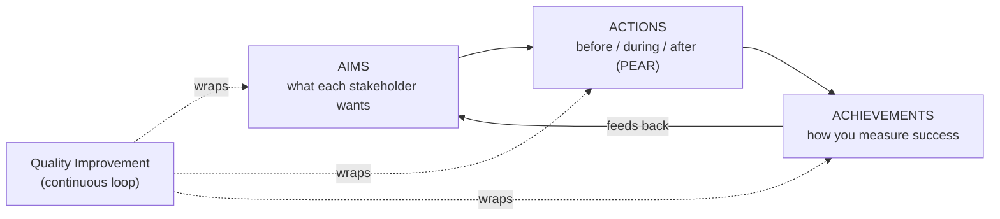

# ITW601 · Module 1 — One-Pager

> **Introduction to WIL — why this subject exists and what "quality" means in it**
> A fast, hand-write-it-yourself sheet. Built for 3 pens on a blank A4 (landscape, ~5 zones).

**Pen legend:** 🖤 Black = skeleton / always-true · 🔵 Blue = definitions & examples · 🔴 Red = Assessment 1 hooks

---

## 🖤 The Big Idea (box it, centre of page)
> **WIL = the workplace IS the site of learning, not a bolt-on to it.**
> Success is judged across 5 stakeholders at once (student, host org, educator, institution, government) — not just "did I get a job out of it."

## 🖤 Zone 1 — What WIL actually is (CEWIL definition)
- 🔵 WIL is a **subset of experiential learning**: intentional partnership between **institution + student + workplace**, at program or course level.
- 🔵 It's **not just employability** — that's one outcome among several (personal capability, lifelong learning capacity).
- 🔵 **9 recognised types**: apprenticeships · co-op · internships · entrepreneurship · service-learning · applied research · mandatory practicum/clinical placement · field placement · work experience.
- 🔴 This student's placement (St Catherine's, ML intervention system, dummy/de-identified data) = **Option 1: Industry Placement**, individual e-Journal assessments — not the Option 2 group Industry Project.

## 🖤 Zone 2 — The Triple-A quality framework (CEWIL)

- 🔵 **PEAR** = Pedagogy, Experience, Assessment, Reflection — the 4 pillars of high-impact WIL, each needed **before/during/after**.
- 🔵 **5 stakeholders & their aims** — Student: hands-on skills, career clarity, network. Host org: talent pipeline, fresh ideas, capacity-building. Educator: engagement, curriculum relevance. Institution: recruitment, retention. Government: funding outcomes, skills gap.
- 🔴 **Reflection is the hardest pillar** — "experience without reflection doesn't lead to learning" (paraphrasing Dewey). This is exactly what the three e-Journal assessments grade you on.

## 🖤 Zone 3 — Boughton's ICT professional types (this module's reading)
- 🔵 Not formal categories — a lens for spotting **professionalism gaps**, judged against: competency, ethicity, knowledgeability, learning ability, care, pride.
- 🔵 Two ends of a spectrum worth memorising: **'highly broadly technical and you know it'** (deep, correct, but poor team player) vs **'big-picture broadly technical'** (visionary, good leader, weak on verification detail).
- 🔴 **Self-check for Assessment 1**: which type does your own placement work currently look like, and which type do you need to *borrow traits from* to ship the intervention system project well?

## 🔴 Assessment 1 hooks (bottom red strip)
> **A1 = e-Journal, 500 words, 25%, due 11/10/2026 (end of Module 4)** · SLOs **a) b)**.
> Structure: Intro (75-100w) → Insightful Observations + Possible Solutions (250-300w) → Conclusion (75-100w).
> Module 1 groundwork that feeds it directly: the "Recommended Task" reflection (ideal ICT role + 2 skills you have + 1 to develop) and the ICT-types self-check above.

## 🔴 If you only memorise 5 things
1. **WIL = institution + student + workplace partnership**, not just "getting a job."
2. **5 stakeholders, each with their own aims** — quality means satisfying all 5, not just yours.
3. **Triple-A: Aims → Actions (PEAR) → Achievements**, wrapped in continuous Quality Improvement.
4. **Reflection is the hard, easily-skipped pillar** — and it's literally the assessment type for this subject.
5. **Boughton's types are a diagnostic tool**, not a personality test — use them to spot gaps, not to label people.

---

### Margin prompts (answer in blue while you write)
1. For your St Catherine's placement, name one AIM each stakeholder (you, the school, A/Prof Memon, Torrens) would have for the ML intervention system project.
2. Which Boughton type best describes how you approached Review Pulse before you added a TF-IDF baseline?

### This-week to-dos (still 🕐 in your notes)
- [ ] Resource 1 — Read Boughton (2013), Ch.5 "What is an ICT Professional Anyway?" (pp.77-94)
- [ ] Resource 2 — Watch "A Quality Framework for WIL" (41 min)
- [ ] Resource 3 — Read the Fast Company career-advice article
- [ ] Activities 1-3 — post drafts (Introduce Yourself, LinkedIn, ICT Types) after review
