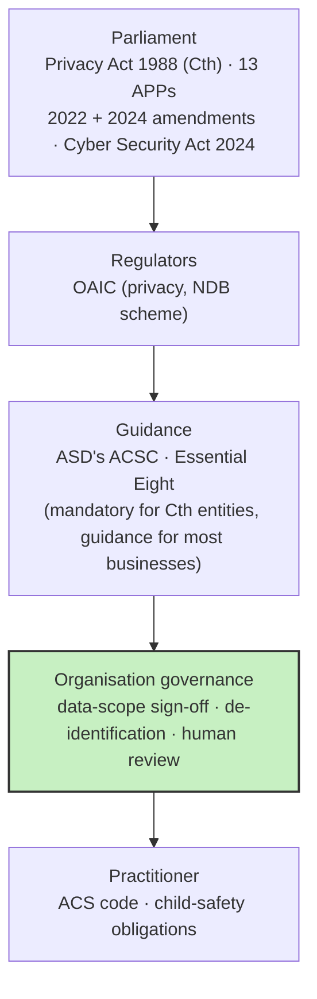

# ITW601 · Module 2 - One-Pager

> **Australian IT Governance and Regulations - who sets the rules for data, and who makes them stick**
> A fast, hand-write-it-yourself sheet. Built for 3 pens on a blank A4 (landscape, ~5 zones).

**Pen legend:** 🖤 Black = skeleton / always-true · 🔵 Blue = definitions & examples · 🔴 Red = Assessment 1 hooks

---

## 🖤 The Big Idea (box it, centre of page)
> **Law sets the floor. Governance decides what actually happens.**
> Regulation always lags the technology, so the organisation's own rules (who may use which data, for what) do most of the day-to-day work.

## 🖤 Zone 1 - Why regulating IT is hard (Samuelson, 2000)
Five challenges for policymakers - sketch as a numbered list:
1. 🔵 **Old law or new law?** Adapt existing law to the internet, or write new law.
2. 🔵 **Proportional response** when new regulation is needed.
3. 🔵 **Flexible laws** that survive fast-changing technology.
4. 🔵 **Preserve human values** under economic/technological pressure.
5. 🔵 **Coordinate across nations** (US vs EU conflict on personal data flows).
- 🔴 Challenge 3 is the one you live: the law will always lag the tools, so internal governance fills the gap.

## 🖤 Zone 2 - Four types of compliance obligation (Chapple, CISSP)
| Type | Made by | Teeth |
|---|---|---|
| **Criminal law** | Legislature | Jail / probation (only type that removes liberty) |
| **Civil law** | Legislature | Damages, court orders |
| **Administrative law** | Executive agencies | Detailed regulations filling gaps in statute |
| **Private regulations** | Industry consortia | Enforced **by contract** (e.g. **PCI DSS**) |

- 🔵 **Privacy laws (US patchwork):** HIPAA (health) · FERPA (student records) · GLBA (finance) · COPPA (children under 13) · Privacy Act 1974 (federal agencies only).
- 🔵 **GDPR** (EU, in force since 25 May 2018): one broad regime, **7 Art. 5 principles** - lawfulness/fairness/transparency, purpose limitation, data minimisation, accuracy, storage limitation, integrity & confidentiality, accountability. *(The CISSP video's "six principles" is historical.)*
- 🔵 **Software licensing:** negotiated contracts (enterprise) · click-through (take it or leave it, rarely read) · shrink-wrap (legacy, physical media).

## 🖤 Zone 3 - Internet governance meets trade law (Mishra, 2019)
- 🔵 Three internet-governance principles: **openness · security · privacy**.
- 🔵 Core argument: security and privacy, done transparently, **enable** openness. They are not only constraints on free data flow.
- 🔵 These (non-binding) principles help apply trade law to data-restrictive measures, balancing domestic regulation with liberalised data flows.
- 🔴 Same logic at school scale: a secure, privacy-respecting parent portal lets the school share **more** with families, not less.

## 🖤 Zone 4 - The Australian layer (sketch as a stack)

- 🔵 **Notifiable Data Breaches (NDB) scheme:** eligible breaches must be notified to the OAIC and affected individuals.
- 🔵 **Gaps vs GDPR:** no general right to erasure · small business (≤ $3M turnover) and employee-records exemptions · no "fair and reasonable" test yet.
- 🔴 Independent schools are generally APP entities, and health information also falls under NSW health records law.

## 🔴 Assessment 1 hooks (bottom red strip)
> **A1 = e-Journal, 500 words, 25%, due 11/10/2026 (end of Module 4)** · SLOs **a) b)**.
> Module 2 gives A1 its constraint vocabulary: the placement project's "de-identified data only, human review before operational use" is a governance decision sitting on top of the Privacy Act. Name it as such in *Insightful Observations and Possible Solutions*.

## 🔴 If you only memorise 5 things
1. **Law sets the floor; governance decides the practice.**
2. **4 compliance types:** criminal · civil · administrative · private (PCI DSS = contract).
3. **GDPR = 7 Art. 5 principles**, broad by default; Australia relies more on thresholds and exemptions.
4. **Mishra: openness, security, privacy are complementary**, not a trade-off.
5. **Australia:** Privacy Act + 13 APPs + NDB scheme, enforced by the OAIC; Essential Eight is guidance for most businesses.

---

### Margin prompts (answer in blue while you write)
1. For your school's student data, which of the four compliance types actually applies, and who enforces each?
2. Which of Samuelson's five challenges shows up most in your placement project's data-scope sign-off?

### Open items
- [ ] Activity 2, point 4 - the Rajaretnam (2019) incident-response recommendations (paper not yet available)
