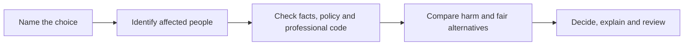

# ITW601 · Module 3 — Ethics in Professional Environment: one-pager

> **Big idea:** a rule can tell me what is allowed; professional judgement asks what I should do, whom it affects and how I can defend the choice.

**Pen guide:** black = decision method · blue = source idea · red = placement/A1 link. This is a study sheet, not evidence that the resources or activity are complete.

## 1. Five lenses for one decision

| Lens | Question to write beside a dilemma |
|---|---|
| Ethics | Which action can I justify to the people affected? |
| Morals | Which personal commitments are influencing my view? |
| Policy | What does the workplace require or permit? |
| Law | What legal duties or rights need checking? |
| Culture | What behaviour does the team actually reward or tolerate? |

Northcutt's introduction distinguishes these lenses. They overlap, but policy compliance alone does not finish the ethical analysis. Source: Northcutt, S. (2004). *IT ethics handbook: Right and wrong for IT professionals*. Syngress, introductory chapter, pp. 1–14.

## 2. A short decision loop

Ask: *Would I still defend this decision if the affected person, a supervisor and an independent reviewer read my reasoning?* If facts are missing, pause and seek the responsible person's guidance.

## 3. Professional codes and blind spots

- The [ITPA code](https://www.itpa.org.au/code-of-ethics/) highlights fairness, privacy, honesty, cooperation and continuing education. Its current webpage is the reading reference; the local PDF is an older version.
- The [ACM code](https://www.acm.org/about-acm/acm-code-of-ethics-and-professional-conduct) adds a useful comparison: public good, avoidance of harm, privacy and professional review. The six-page local PDF is ACM, not ITPA.
- [Chugh's TED talk](https://www.ted.com/talks/dolly_chugh_how_to_let_go_of_being_a_good_person_and_become_a_better_person) challenges the need to see oneself as always “good”; owning mistakes creates room to improve judgement.

## 4. Activity 1: three scenarios, one method

1. **Casual employment:** fairness, choice and security matter alongside flexibility. Ask about predictable hours, pay and the worker's actual preference.
2. **Discarded office paper:** “waste” is not the same as cleared for release. Check confidentiality and permission before taking anything off site.
3. **Personal calls or social media:** apply policy consistently, protect work time and allow proportionate handling of genuine personal needs.

Write **no more than 100 words per scenario**. The [draft responses](activity01_ethical-thinking_draft.md) are for review, not forum submission.

## 5. A1 placement hook

The academic data problem is ethical as well as technical: a recent refresh can still omit relevant results. A staff profile should show source coverage and age, restrict access, and preserve human review. In A1, describe the observed problem and proposed checks; reserve claims of approval, implementation or benefit for evidence collected later.

**Before using this sheet:** confirm actual placement actions and policies; check the A1 brief's word limit and the distinction between observed facts and proposals.
