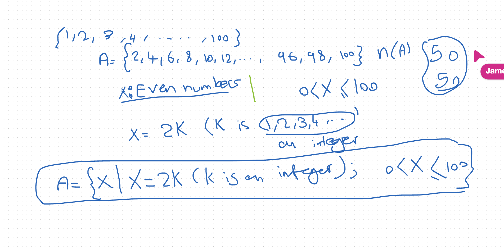
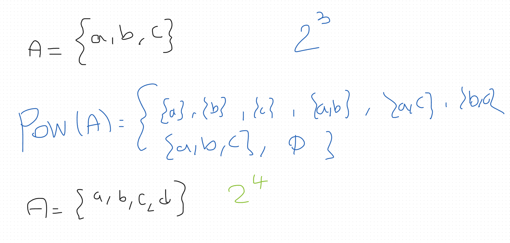
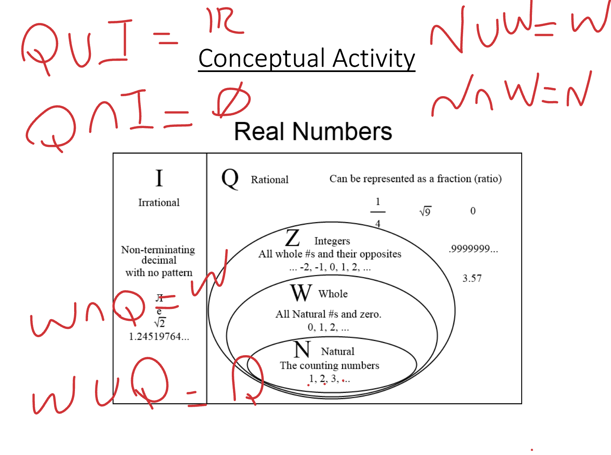
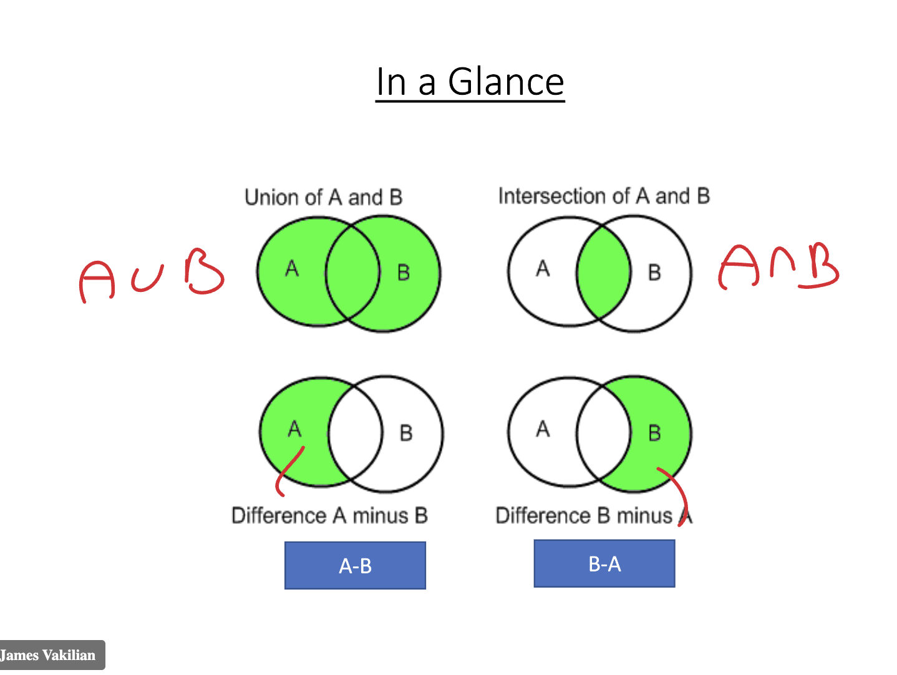

# Notes for MFA502

## Module 1 - Introduction to Machine Learning (MFA)

### I. Introduction to Set Theory
    - Set → A collection of objects.
        - A carpenter’s tool box → set.
        - All presidents of USA → set.
        - Your ten best friends → set.
        - All the programming languages → Set.
    - We understand sets intuitively.
    - The objects in a set may be similar or different.
    - A set may contain finite number of objects → Finite Sets
    - A set might contain infinite number of objects → Infinite Sets
> A set is a collection of items which have a common trait

Collection of tall boys: Not a set
Collection of boys higher than 1.8m: Set

{ x | x=2k (k is an integer); and 1<=x<=100 } is the set of even numbers

### Activity 1 - 15'
1) Identify three different sets
> set1 `even numbers less than 12` = { 2, 4, 6, 8, 10 }  
> set2 `common household pets` = { cat, dog, rabbit, guinea pig } 
> set3 `top 5 tech companies` = { apple, google, amazon, microsoft, meta } 

- how many elements does each have? 
> n(set1) = 5
> n(set2) = 4
> n(set3) = 5

- are they well-defined? 
> yes

- what are its elements?
> set1 = { 2, 4, 6, 8, 10 }
> set2 = { cat, dog, rabbit, guinea pig }
> set3 = { apple, google, amazon, microsoft, meta }

- would everyone agree with the elements?
> I believe so, since the membership is clear

2) Give two example of a null set
> Ø1 = {x | x is a natural number less than 0 } -> no such number meets this condition
> Ø2 = {x | x is a student who scored 11 out of a 10 exam } -> not possible

3) Give two example of a universal set
> context = numbers up to 20 -> U1 = {1, 2, …, 20}
> context = programming languages -> U2 = {Python, Javascript, Java, C++, C#, ...}

### II. Subsets
A = {1,2,3}
B = {x|0<=x<=50}
A⊆B // A is a subset of B

Conceptual Activity:
N⊆Z⊆Q⊆R

### III. Some Operations in Set Theory

Power set
If A has n members, then the power set of A has 2^n members
`pow(A) = {x | x⊆A}`

Example:
if A={a,b}
Then pow (A) has 2^2 = 4 members
That is: `pow({a,b}) = {{}, {a}, {b}, {a,b}}`

Intersection of sets:

### IV. Undefined Concepts and Program Syntax
### V. Tutorial

## Takeways:
- 

## Questions for Dr. James Vakilian:
- n/a

## Follow up
- ...
