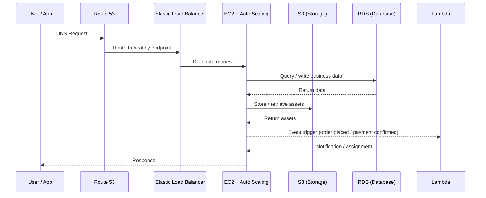
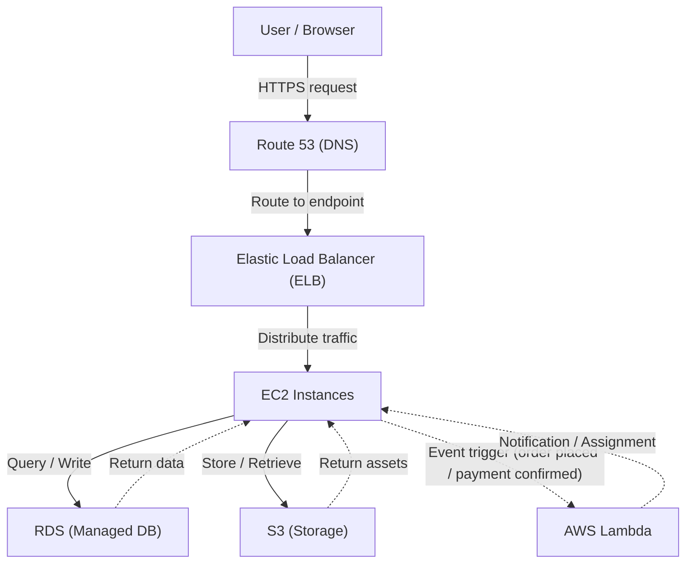

# Designing a Cloud Architecture from Scratch: My CCF501 Assessment 1

Tags: #cloudcomputing #aws #architecture #buildinpublic

---

**AWS gives you 200+ services. My Masters assignment asked me to pick the right ones - and justify every decision.**

---

## The Challenge

This term I'm studying **Cloud Computing Fundamentals (CCF501)** at Torrens University Australia. Assessment 1 was a design challenge: propose a secure, scalable cloud architecture for **ABC Enterprises** - a fictional delivery and payments startup modernising its entire IT infrastructure.

The case study numbers set the stakes:
- **~80% reduction** in start-up IT costs after moving to cloud
- **10x customer surge** absorbed in a single month, with no additional headcount

No recipe given. Just requirements, a blank canvas, and a word count.

This article is the full breakdown behind the LinkedIn post I shared - the reasoning, the trade-offs, and what the exercise actually taught me.

---

## Why Cloud? (And Why Not On-Premises)

Traditional IT means owning servers, cooling, and the staff to keep it all running. For a high-growth startup like ABC, that model is a strategic liability. You buy capacity for a projected peak, sit on idle hardware during troughs, and wait weeks for procurement when demand surges beyond forecast.

Cloud flips the model: rent capability, not hardware. The NIST definition nails it with five characteristics:

| NIST Characteristic | What It Means for ABC |
|---|---|
| On-Demand Self-Service | Dev team spins up EC2 and RDS via console - no vendor call required |
| Broad Network Access | App accessible via mobile and browser across delivery, taxi, and payments verticals |
| Resource Pooling | ABC shares AWS physical hardware; workloads logically isolated per tenant via VPC |
| Rapid Elasticity | 10x surge absorbed automatically - no procurement delay, no manual intervention |
| Measured Service | ~80% reduction in start-up IT costs - pay only for compute-hours and GB-months consumed |

---

## Three Benefits That Mattered for ABC

### 1. Cost Efficiency: CAPEX to OPEX

Cloud shifts spend from capital expenditure (hardware you buy) to operational expenditure (capacity you consume). The ~80% reduction in start-up IT costs is the measured service characteristic in action. As workloads grow, standard operations - backups, patching, scaling - get codified and automated, reducing human toil across the pipeline.

### 2. Rapid Scalability Without Procurement

A 10x customer surge in a single month exposes the core weakness of on-premises: procurement lead times mean hardware arrives after the opportunity has passed. EC2 Auto Scaling provisions or terminates instances based on CloudWatch signals - capacity becomes policy-driven, not operator-driven.

### 3. Reduced IT Management Overhead

In on-premises environments, more customers means more infrastructure and more staff to maintain it. Cloud breaks that linear relationship. Through resource pooling, providers consolidate physical resources across tenants, letting ABC gain resilient architectures that would be expensive to replicate in-house.

---

## The Architecture

I chose AWS - partly because Route 53 was already in the described stack, and partly because the managed-service breadth made every design decision straightforward to defend.

Here's how the stack layers together:

1. **Route 53**: DNS layer, the front door. Handles routing and health checks at the DNS level.
2. **Elastic Load Balancer (ELB)**: distributes inbound traffic across EC2 instances, runs health checks before requests hit compute, integrates natively with Auto Scaling.
3. **EC2 + Auto Scaling**: horizontally scalable compute. Provisions or terminates instances on demand signals. Absorbed the 10x surge with zero manual intervention.
4. **S3**: object storage for assets, backups, and static content. Pay-per-GB, no provisioned minimum, practically unlimited ceiling.
5. **RDS**: managed relational database (PostgreSQL). Removes operational overhead of running your own DB server. Multi-AZ for resilience, read replicas on demand.
6. **Lambda**: event-driven compute for workflow automation: order placed → delivery assigned; payment confirmed → restaurant notified. Scales to zero when idle, charges only per invocation.

The traffic flow looks like this:

And the high-level architecture:

---

## The Three Challenges (and How to Mitigate Them)

Cloud adoption is not risk-free. Three challenges are most relevant for ABC:

### 1. Security and Privacy

ABC handles payments and customer PII. Security is the top concern for cloud adopters - 90% of security professionals cite it as a challenge. Mitigation isn't a single switch; it's a cascade:

- IAM least-privilege policies - nothing gets more access than it needs
- Mandatory MFA on all console and API access
- Encryption at rest and in transit across S3, RDS, and Lambda
- Security groups on EC2 as a network firewall layer
- AWS WAF + Shield Standard at the perimeter

The shared responsibility model is the mental model here: AWS secures the infrastructure, ABC secures what runs on it.

### 2. Cost Volatility

Pay-as-you-go can spiral without guardrails - overprovisioned instances and excessive egress generate surprise bills. Mitigation: FinOps habits from day one. Budget alerts, resource tagging, rightsizing, and reserved pricing for stable workloads.

### 3. Vendor Lock-in and Skills Gap

Deeper managed-service adoption makes provider migration expensive. Mitigation: prioritize portability (containers, standard databases) and invest in targeted upskilling. The skills gap is a real cost that rarely appears in TCO calculations.

---

## Deployment and Service Model

### Why Public Cloud

| Deployment Model | Cost | Elasticity | ABC Fit |
|---|---|---|---|
| Public Cloud | Low - OPEX only | High - Auto Scaling | ✅ Recommended |
| Private Cloud | High - CAPEX + ops staff | Limited - fixed capacity | ❌ Over-engineered for a startup |
| Hybrid Cloud | Medium - dual infrastructure | Moderate - complex to manage | ⚠️ Premature for current maturity |

Public cloud is the clear fit. IBM reports IaaS workloads experience 60% fewer security incidents than traditional data centres - so "private = more secure" is a myth worth dispelling.

### Why IaaS + PaaS (Not SaaS)

Cloud service models sit on a control-versus-responsibility spectrum. IaaS gives compute flexibility. PaaS abstracts infrastructure so the team can focus on development. SaaS offers limited customisation - less suited to a startup that must differentiate its platform.

**Recommendation:** Blend IaaS (EC2 for compute flexibility) with PaaS (RDS and Lambda as managed services). Add a VPC for network isolation as the platform matures.

---

## Cost Model

Three levers exist:

1. **Pay-as-you-go**: maximum flexibility, highest unit price
2. **Reserved/committed pricing**: discounts of 30–60% for baseline commitments
3. **Spot/preemptible**: deep discounts for interruption-tolerant workloads

**Recommendation:** A hybrid cost model - reserved capacity for stable customer-facing tiers (web/app, databases), pay-as-you-go autoscaling for demand spikes, and spot instances for background jobs and analytics pipelines.

Cloud adoption is rarely about the cheapest bill. It's about better ROI: less downtime, faster launches, and automation that avoids linear headcount growth.

---

## Why AWS Over Azure or GCP

| Provider | Ecosystem Fit | Load Balancing | Serverless | ABC Alignment |
|---|---|---|---|---|
| AWS | Broadest managed-service catalogue | ELB - native Route 53 integration | Lambda - event-driven, zero idle cost | ✅ Best fit - Route 53 already in stack |
| Azure | Microsoft / enterprise-aligned | Application Gateway - extra config | Azure Functions - separate ecosystem | ⚠️ No Microsoft signals in ABC |
| GCP | Analytics and ML-first | Cloud Load Balancing - GKE-oriented | Cloud Run / Functions - container-first | ❌ No analytics-heavy workloads yet |

The Route 53 signal was decisive. It's not just familiarity - it means the DNS and load balancing layers integrate natively, reducing configuration surface area and failure points.

---

## What the Exercise Actually Taught Me

The biggest insight wasn't choosing between AWS services. It was understanding *why* you layer them the way you do.

Security is not a layer you add at the end. It lives at every tier:
- DNS filtering at Route 53
- Traffic rules at the load balancer
- Security groups on EC2
- IAM policies on S3 and Lambda
- Encryption at the data layer

Similarly, scalability isn't one Auto Scaling policy. It's a cascade: DNS health checks → load balancer distribution → compute elasticity → database read replicas. Each layer has to be designed to hand off load gracefully to the next.

The other thing I'll carry forward: **reserved instances vs on-demand pricing is an architectural decision, not just a finance conversation.** What you commit to reserved shapes what you build around it.

---

## Full Services Provisioned

| AWS Service | Role | Baseline Config | Scale Ceiling |
|---|---|---|---|
| EC2 (web/app tier) | Serve API requests | 2× t3.medium | 20× c5.xlarge |
| Auto Scaling | Scale EC2 fleet on demand | Policy-driven (CloudWatch) | Absorbed 10x surge, zero manual intervention |
| ELB | Distribute inbound traffic | Always-on | Scales transparently |
| RDS (PostgreSQL) | Structured data: orders, rides, payments | db.r5.large, Multi-AZ | Read replicas on demand |
| S3 | Receipts, media assets, backups | Pay-per-GB | Unlimited |
| Lambda | Event-driven workflows | 128 MB / 3s timeout | 1,000 concurrent (raisable) |
| Route 53 | DNS routing and health checks | Always-on, per-query billing | Globally redundant |
| VPC | Network isolation | Single VPC, subnet per tier | Peering + private endpoints as needed |
| CloudFront | CDN - static asset delivery | Global edge | Scales to any volume |
| CloudWatch | Monitoring and autoscale triggers | Always-on | 15 months metric retention |
| AWS WAF + Shield | DDoS mitigation, traffic filtering | Shield Standard (free) | Shield Advanced available |

---

## Building in Public

Studying for a Masters while working full-time means assignments like this don't stay abstract. The same patterns - load balancing, autoscaling, IAM, cost modelling - appear in the systems I work with every week.

I'm sharing the architecture diagrams, the reasoning, and the assessments publicly because the learning compounds when it's in the open.

- 📋 [Assessment Brief - CCF501 Assessment 1](https://github.com/lfariabr/masters-swe-ai/blob/master/2026-T1/CCF/assignments/Assessment1/CCF501_Assessment1.pdf)
- 📄 [My Report - Technology Report and Presentation](https://github.com/lfariabr/masters-swe-ai/blob/master/2026-T1/CCF/assignments/Assessment1/drafts/report/vf_CCF501_Faria_L_Assessment_1.pdf)
- 🖥️ [My Presentation Slides](https://github.com/lfariabr/masters-swe-ai/blob/master/2026-T1/CCF/assignments/Assessment1/drafts/presentation/vf_CCF501_Faria_L_Assessment_1.pdf)

If you're designing cloud architectures - or just starting to think about them - what pattern challenged your assumptions the most?

---

## Let's Connect

- **LinkedIn:** [linkedin.com/in/lfariabr](https://www.linkedin.com/in/lfariabr/)
- **GitHub:** [github.com/lfariabr](https://github.com/lfariabr)
- **Portfolio:** [luisfaria.dev](https://luisfaria.dev)

---

## References

Amazon Web Services. (n.d.-a). *AWS Well-Architected Framework*. https://aws.amazon.com/architecture/well-architected/

Amazon Web Services. (n.d.-b). *AWS Pricing*. https://aws.amazon.com/pricing/

Bittok, T. (2022). Cloud total cost of ownership. *LinkedIn Pulse*. https://www.linkedin.com/pulse/cloud-total-cost-ownership-theophilus-bittok-/

Eliaçık, E. (2022). Pros and cons of cloud computing. *Dataconomy*. https://dataconomy.com/2022/05/pros-and-cons-of-cloud-computing-2022/

IBM. (n.d.-b). What is a public cloud? *IBM*. https://www.ibm.com/think/topics/public-cloud

McHaney, R. (2021). *Cloud technologies: An overview of cloud computing technologies for managers*. Wiley.

Mell, P., & Grance, T. (2011). *The NIST definition of cloud computing* (Special Publication 800-145). NIST. https://doi.org/10.6028/NIST.SP.800-145